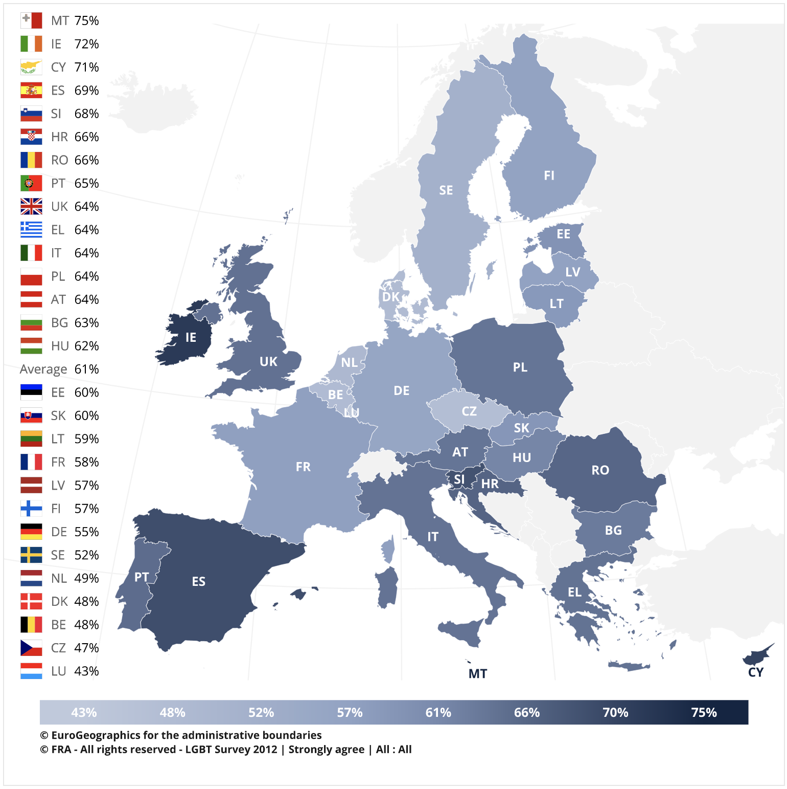

# Introduction

This is a data analysis of LGB celebrities from ["List of gay, lesbian or bisexual people" on Wikipedia](https://en.wikipedia.org/wiki/List_of_gay,_lesbian_or_bisexual_people).  

I scraped the data from wiki page using Python and conduct data tidying, the exploratory data analysis and data visualization using R.  

The purpose of this analysis is trying to answer the following questions:  

* How many LGB celebrities are there?  
* People are getting more willing to come out. Is this true?  
* What kinds of professions are LGB people known for?  
* As a member of LGB community, where should you live?  

Note that as Wikipedia states, "this is a partial list of confirmed famous people who were or are gay, lesbian or bisexual. Famous people who are simply rumored to be gay, lesbian or bisexual, are not listed." Also note that I use the word LGB instead of LGBTQ+ since this data only covers LGB celebrities.  

# Data Tidy

```{r setup}
library(tidyverse)
library(readxl)
library(knitr)
opts_chunk$set(message = FALSE, warning = FALSE)
```

Let's start by loading the data into R and take a quick glance at it. The file **lgbList.csv** is the data I scraped from Wikipedia using Python. You can find how I did the webpage scraping in **lgbList.ipynb**.

```{r}
lgbList <- read_csv("lgbList.csv")
kable(head(lgbList))
```

I did some data transformation to make them easier for further analysis. 

```{r}
d <- lgbList %>% 
  # remove unnecessary information in data and rename column names
  separate(col = `Notes[6]`,
           into = c("Category", NA),
           sep = 1) %>% 
  rename(Lifetime = `Lifetime[5]`) %>% 
  # filter out observations that do not specify their category of LGB
  filter(!is.na(Category),
         Category != "[") %>% 
  # Separate the column Lifetime into Birth and Death for further analysis
  separate(col = Lifetime,
           into = c("Birth", "Death"),
           sep = "([—–−-])")

# Birth data is pretty messy, including useless prefixes and punctuation marks which need to be removed
d$Birth <- str_extract(d$Birth, "\\d\\d.*")
d <- d %>% 
  separate(col = Birth, into = c("Birth", NA), sep = "([ /}?s])") %>% 
  separate(col = Birth, into = c("Birth", NA), sep = 4) %>% 
  mutate(Birth = as.numeric(Birth))

# remove the parentheses following some of the nationalities
d$Nationality <- str_remove_all(d$Nationality, "\\s\\(.+")

kable(head(d))
```

Now we finally get a tidy data frame with `r ncol(d)` variables and `r nrow(d)` observations.

# EDA

In the exploratory data analysis, we're going to dig into each variables and try to answer some questions.

## Category

> How many LGB celebrities are there? What is the proportion of each category?

```{r}
d %>% 
  group_by(Category) %>% 
  summarise(counts = n(),
            prop = round(n() / nrow(d), 2)) %>% 
  ggplot(aes(x = "", y = counts, fill = Category)) +
  geom_bar(stat = "identity", width=1) +
  coord_polar(theta = "y", start=0) +
  theme_void() +
  geom_text(aes(label = paste0(Category, "\n", counts, ", ", prop * 100, "%")), 
            position = position_stack(vjust = 0.6)) +
  labs(title = "How many LGB celebrities are there?", 
       subtitle = "What is the proportion of each category?") +
  scale_fill_brewer(palette = "RdYlBu")
```

Though pie chart is not recommended in *Storytelling With Data by Cole Nussbaumer Knaflic*, I consider that the question here is simple so a pie chart seems to be straightforward given only three categories for comparison.

## Birth

> People are getting more willing to come out. Is this true?

```{r}
lgbBirth <- d %>% 
  filter(!is.na(Birth)) %>% 
  group_by(Birth) %>% 
  summarise(counts = n())

ggplot(lgbBirth, aes(x = Birth, y = counts)) +
  geom_line() +
  coord_cartesian(xlim = c(1800, 2000)) +
  labs(title = "More and more LGB celebrities in the past century",
       x = "LGB Celebrities' Birth Year",
       y = "Counts of LGB Celebrities")
```

If we only look at the Birth data, there are more LGB celebrities in the past century for sure. However, this might result from the fact that there is more data on Wikipedia in recent years. Another thing is that we don't have the data of their coming-out age, which makes it hard to figure out the reason behind the drop from 1970 to 2000. It might be that the celebrities usually come out in later years, or that in the past decades less and less celebrities came out.

Let's focus on celebrities who are still alive.

```{r}
lgbAge <- d %>% 
  filter(is.na(Death) & !is.na(Birth)) %>% 
  mutate(Age = 2020 - Birth) %>% 
  filter(Age < 150)
```

```{r}
ggplot(lgbAge) +
  geom_bar(aes(x = Age)) +
  labs(title = "Most LGB celebrities are at their middle age")
```

```{r}
ggplot(lgbAge) +
  geom_boxplot(aes(y = Age, color = Category)) +
  labs(title = "The distribution of LGB celebrities' age by category")
```

The median is at the age of `r median(lgbAge$Age)`. Bisexual group has a slightly lower distribution with its median at the age of `r median(lgbAge[lgbAge$Category == "B", ]$Age)`.

```{r}
ggplot(lgbAge) +
  geom_histogram(aes(x = Age)) +
  facet_wrap(~Category)
```

```{r}
ggplot(lgbAge) +
  geom_freqpoly(aes(x = Age, color = Category))
```

## Notable as

> What kinds of professions have LGB people been known for?

For the LGB celebrities with more than 1 professions they have been known for, I would like to take all professions into account without removing any of them. For example, a celebrity can be a poetry and a journalist at the same time and during the analysis he/she will be in both profession group.

```{r}
dProf <- d %>% 
  separate_rows(`Notable as`, sep = ", ")
dProf$`Notable as` <- str_to_title(dProf$`Notable as`)
  
lgbProf <- dProf %>% 
  group_by(`Notable as`) %>% 
  summarise(counts = n(),
            prop = round(n() / nrow(d), 4)) %>% 
  arrange(desc(counts))

lgbProf %>% head() %>% kable()
```

Actor, writer and politician account for around 35% of all professions.  
Let's take a closer look at the top 10 professions.

```{r}
dProf %>% 
  filter(`Notable as` %in% lgbProf[1:11, ]$`Notable as`) %>% 
  ggplot() +
  geom_bar(aes(x = `Notable as`, fill = Category), position = "dodge")
```

The gay group appears to be the most of each professions. In general, the lesbian is more than the bisexual except for the actor and singer.

## Nationality

> As a member of LGB community, where should you live?

Let's look at the nationality of these LGB celebrities first.

```{r}
lgbNationality <- d %>% 
  group_by(Nationality) %>% 
  summarise(counts = n(),
            prop = round(n() / nrow(d), 4)) %>% 
  mutate(ranking = min_rank(desc(counts))) %>% 
  arrange(ranking)

kable(head(lgbNationality))
```

Obviously, the American and the British have already account for over 55% of all.  

In order to answer the question here, I add a column with country data so that I can visualize it on a map. The country name is not consistent with that in the map data we'll use later, so some data tidying needs to be done first.  

Note:  

* The Scottish and Welsh are categorized as United Kingdom.  
* Celebrities with dual nationalities are removed.  
* Celebrities with nationalities that do not exist nowadays are removed (i.e. Roman, Prussian, etc.).  

```{r}
# load a csv file with a table of country names and nationality names
country <- read_csv("country2.csv") %>% 
  select(-Demonyms) %>% 
  # remove strings with [] or () because they're unnecessary here
  mutate(across(everything(), str_remove_all, "(\\[.\\])|(\\s\\(.+)")) %>% 
  # separate multiple values in one cell into multiple rows
  separate_rows(Adjectivals, sep = ", ") %>% 
  # reverse the short country names to long ones
  mutate(across("Country/entity name", str_replace, "(.*)(,\\s.*)", "\\2 \\1"), 
         across("Country/entity name", str_remove, "^, ")) %>% 
  rename(Country = `Country/entity name`,
         Nationality = Adjectivals)

# join two tables together
lgbNation <- d %>% 
  left_join(country, by = "Nationality") %>% 
  filter(!is.na(Country)) %>% 
  group_by(Country) %>% 
  summarise(counts = n(),
            prop = round(n() / nrow(d), 4)) %>% 
  mutate(ranking = min_rank(desc(counts))) %>% 
  arrange(ranking)

kable(head(lgbNation))
```

```{r}
summary(lgbNation$counts)
```

3 or less celebrity came out in 50% of the countries.  

Out of curiosity, I searched for Taiwanese celebrities.

```{r}
lgbNation %>% filter(Country == "Taiwan") %>% kable()
```
```{r}
d %>% filter(Nationality == "Taiwanese") %>% kable()
```

There are 8 Taiwanese LGB celebrities, ranking the 43rd. However, since Taiwanese celebrities have little English records on wiki, there could be more of them than this number.  

Now I'm going to plot the data above on a map by using packages `sf`, `rnaturalearth`, and `rgeos`.

```{r}
library(sf)
library(rnaturalearth)
library(rgeos)

world <- ne_countries(scale = "medium", returnclass = "sf") %>% 
  left_join(lgbNation, by = c("geounit" = "Country")) %>% 
  mutate(prop_pop = counts / pop_est)

world %>% as_tibble() %>% head() %>% kable()
```

```{r}
world %>% 
  ggplot() +
  geom_sf(aes(fill = counts), color = "white") +
  coord_sf(xlim = c(-160, 160), ylim = c(-55, 80)) +
  scale_fill_viridis_c(option = "viridus", alpha = 0.4) +
  labs(title = "US dominates where LGB celebrities came from") +
  theme_void()
```

Since US accounts for around 45% of all, it becomes hard to distinguish the number of LGB celebrities in other countries. I'll do some tricks to improve the visualization.

> LGB celebrities' proportion of population in each country

```{r}
world %>% 
  ggplot() +
  geom_sf(aes(fill = prop_pop), color = "white") +
  coord_sf(xlim = c(-160, 160), ylim = c(-55, 80)) +
  scale_fill_viridis_c(option = "viridus", alpha = 0.4) +
  theme_void()
```

When we consider the proportion of population in each country these celebrities account for, Australia, New Zealand, Canada, Finland, Sweden, Norway, Iceland and Ireland become outstanding on the plot.

> Focus on the data by continent - European Union

I'll use some of the survey results from [European Union Agency for Fundamental Rights](https://fra.europa.eu/en/publications-and-resources/data-and-maps/survey-fundamental-rights-lesbian-gay-bisexual-and) to make comparison between the number of LGB celebrities in each EU country and how EU people really feel about it. Note that EU's data was collected in 2012.

```{r}
eu <- read_excel("2020-10-19-xls_exportSurveyTopic-LGBT-AllSubset-01--All-1--Daily-Life-EN.xlsx", skip = 10)

world %>% 
  filter(name_long %in% eu$CountryCode) %>% 
  ggplot() +
  geom_sf(aes(fill = counts), color = "black") +
  coord_sf(xlim = c(-20, 40), ylim = c(35, 70)) +
  scale_fill_viridis_c(trans = "sqrt") +
  geom_sf_text(aes(label = name_long), color = "gray80", size = 2) +
  theme_void()
```

When we look at the number of LGB celebrities, UK, France and Germany appear to be the most in EU. 

```{r}
world %>% 
  filter(name_long %in% eu$CountryCode) %>% 
  ggplot() +
  geom_sf(aes(fill = prop_pop), color = "black") +
  coord_sf(xlim = c(-20, 40), ylim = c(35, 70)) +
  scale_fill_viridis_c(trans = "sqrt") +
  geom_sf_text(aes(label = name_long), color = "gray80", size = 2) +
  theme_void()
```

If we also consider the population of each country, the proportion of LGB celebrities is relatively high in Ireland, Sweden, Finland, Denmark, Netherlands, Luxembourg and Malta as well.  

Below is a figure from the EU survey result of the question:  
What would allow you to be more comfortable living as a lesbian, gay or bisexual person in the country where you live? Public figures in politics, business, sports, etc openly speaking in support of lesbian, gay and bisexual people?

<center>

</center>

Over 70 % of the Irish and the Maltese strongly agree that public figures openly speaking in support of LGB people can make life more comfortable as a LGB person. As the result we got from previous figure that there is a high proportion of LGB celebrities in Ireland and Malta, we can conclude that these two countries might be great options for living in EU.  

> Focus on the data by continent - Asia

```{r}
lgbAsia5 <- world %>% 
  filter(continent == "Asia") %>% 
  arrange(desc(counts)) %>% 
  select(name, counts) %>% 
  as_tibble() %>% 
  filter(min_rank(desc(counts)) <= 5)

world %>% 
  filter(continent == "Asia") %>% 
  ggplot() +
  geom_sf(aes(fill = counts), color = "white") +
  coord_sf(xlim = c(20, 150), ylim = c(-15, 60)) +
  scale_fill_viridis_c(option = "viridus") +
  geom_sf_text(data = subset(world, name %in% lgbAsia5$name), 
               aes(label = paste0(name, "\n(", counts, ")")), 
               color = "black", size = 4, nudge_x = -4.5) +
  theme_void()
```
```{r}
world %>% 
  filter(continent == "Asia") %>% 
  ggplot() +
  geom_sf(aes(fill = prop_pop), color = "white") +
  coord_sf(xlim = c(20, 150), ylim = c(-15, 60)) +
  scale_fill_viridis_c(option = "viridus") +
  theme_void()
```

The number of LGB celebrities in China, India, Japan and Philippines seem quite a lot. However, if we take the population of each country into account, the proportion of LGB celebrities seems the same among all countries in Asia.
